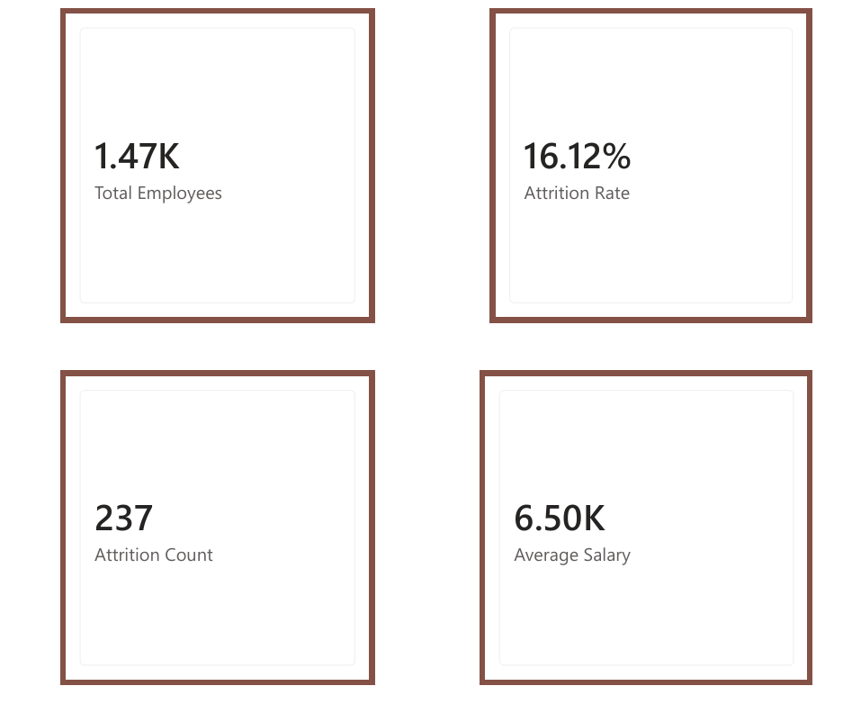
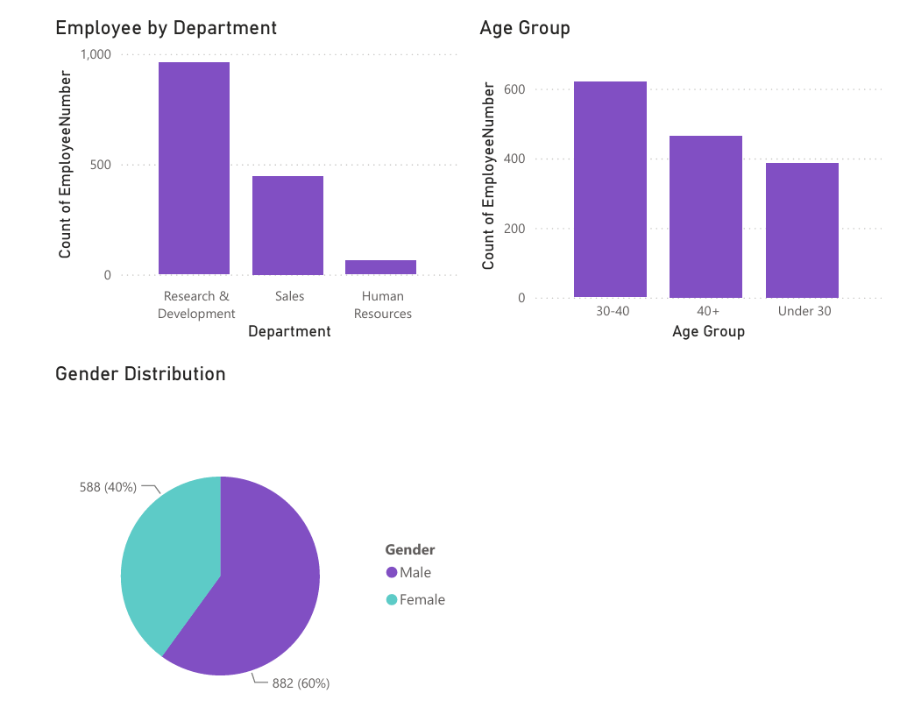
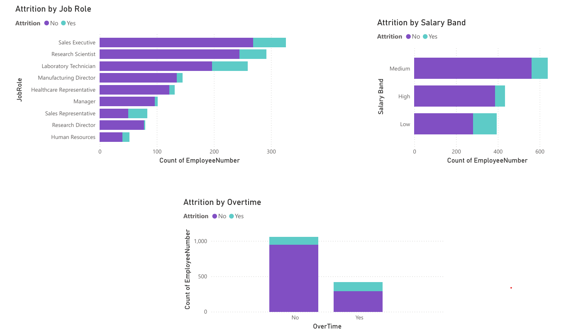

# IBM HR Analytics Employee Attrition Dashboard

## Project Overview

This project analyzes employee data to understand factors affecting employee attrition and workforce trends.

## Tools Used

- Excel
- SQL
- Python
- Power BI

## Dataset

IBM HR Analytics Employee Attrition & Performance dataset.

## Data Cleaning

Performed:

- Removed duplicate records
- Checked missing values
- Standardized text values
- Created Age Groups
- Created Salary Bands

## Analysis Performed

### Excel

- Pivot tables
- Employee analysis
- Attrition analysis
- Average salary analysis

### SQL

Answered business questions:

- Attrition by department
- Average salary by department
- Employee count analysis
- Attrition Count

### Python

Performed:

- Data exploration
- Statistical analysis
- Visualization

### Power BI Dashboard

Created an interactive HR Analytics Dashboard to analyze employee attrition and workforce trends.

The dashboard contains three pages:

#### Page 1: HR Overview

Includes key HR metrics:

- Total Employees
- Attrition Count
- Attrition Rate
- Average Salary

#### Page 2: Workforce Analysis

Focuses on employee demographics and workforce distribution:

- Employee Count by Department
- Age Group Analysis
- Gender Distribution

#### Page 3: Attrition Analysis

Analyzes factors affecting employee attrition:

- Attrition by Job Role
- Attrition by Salary Band
- Attrition by Overtime

## Dashboard Preview

### Page 1: HR Overview

### Page 2: Workforce Analysis

### Page 3: Attrition Analysis

